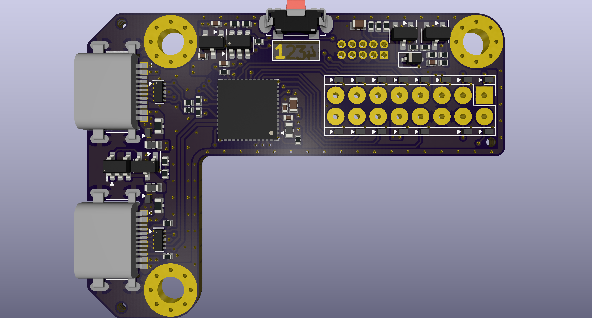
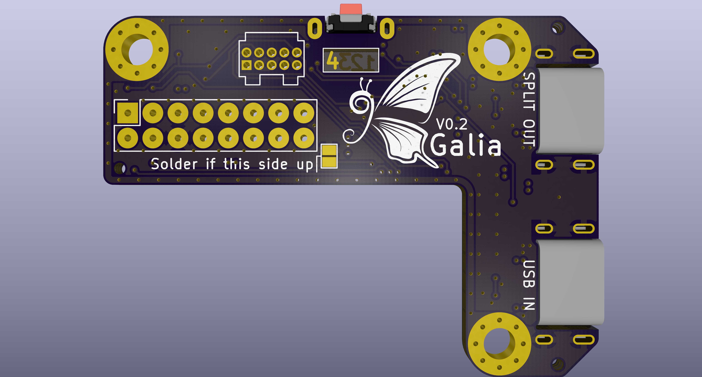

# Galia
Modular split ergonomic keyboard system with each half consisting of a central motherboard and a hot-swappable key cluster daughterboard to allow for maximum flexibility.

### Motherboard

- Current version: V0.2.
- Schematic [here](https://kicanvas.org/?repo=https%3A%2F%2Fgithub.com%2Fghostlybutterfly%2FGalia%2Fblob%2FV0_dev%2FMotherboard%2FMotherboard.kicad_sch). 
- Board layout [here](https://kicanvas.org/?repo=https%3A%2F%2Fgithub.com%2Fghostlybutterfly%2FGalia%2Ftree%2FV0_dev%2FMotherboard).
### Daughterboard (Cantaloupe)
Current version: N/A (wip).

## Disclaimer
This keyboard is licensed under [CERN-OHL-S-2.0](https://cern-ohl.web.cern.ch/) and is compatible with both [QMK Firmware](https://qmk.fm/) and [ZMK Firmware](https://zmk.dev).

## Key Features
### Motherboard
* Fully reversible, compact (35.6x50.0mm), and designed to fit onto the top inner corner of a split keyboard.
* On-board STM32G0B1CCU7 processor.
* ESD-protected USB-C input port and USB-C split comms ports with ideal diode configuration for reverse current protection on VBUS input.
* Connects to daughterboard through fully ESD-protected 2.54mm pitch 02x08 pogo header in [VIK](https://github.com/sadekbaroudi/vik) breakout layout with three additional GPIO and reset button pin.
* 4-layer (signal/ground/power/signal) PCB, guard ring, and star ground connection point in between USB port shields to reduce EMI.
* 5V output rail limited to ~188mA through the use of a TPS2553D current limiting switch with EN pin controlled through firmware to reduce RGB LED quiescent current draw.
* 2x05 1.27mm Samtec IDC SWD header for debugging purposes.
* On-board button[Acheron](https://acheronproject.com/reset_article_1/reset_article_1/#52-substituting-the-jfet) single-button reset circuit.

### Daughterboard (TBC)
* Matrix scan planned to be implemented through 74HC595 SIPO shift registers for low power draw and compatibility with ZMK interrupt functionality.
* Also compatible with charlieplex, duplex, and standard matrix layouts.
* WS2812 and AP102 RGB LED support.
* Additional [VIK](https://github.com/sadekbaroudi/vik) header support if desired.
* USART1, USART3, and reset circuit pins routed to pogo pin header to allow for relocation of split comms receptacle and reset button on daughterboard.

## Pogo header pinout
| Function/description                  | Pin name | Row 1 | Row 2 | Pin name | Function/description                  |
| ------------------------------------- | -------- | ----- | ----- | -------- | ------------------------------------- |
| Active high, hold for 3s for DFU      | N/A      | RST   | GPIO5 | B8       | SPI2 SCK/TIM4 CH3/I2C1 SCL            |
| USART1 TX/SPI2 MISO/I2C1 SCL/TIM1 CH3 | B6       | GPIO3 | GPIO4 | B7       | USART1 RX/SPI2 MOSI/TIM4 CH2/I2C1 SDA |
| 200mA max draw across system          | N/A      | 3V3   | GND   | N/A      | N/A                                   |
| I2C2 SDA                              | B14      | SDA   | SCL   | B13      | I2C2 SCL                              |
| SPI2 MOSI/TIM2 CH4                    | B11      | RGB   | 5V    | N/A      | 188mA max draw by daughterboard       |
| USART3 TX/SPI2 MISO/ACD IN10          | B2       | GPIO1 | MOSI  | A7       | SPI1 MOSI                             |
| USART3 RX/TIM3 CH3/TIM1 CH2N/ADC IN8  | B0       | GPIO2 | CS    | A4       | SPI1 NSS                              |
| SPI1 MISO                             | A6       | MISO  | SCK   | A5       | SPI1 SCK                              |

## VIK keyboard certification card
| Category                 | Classification          | Response           |
| -----------------------  | ----------------------- | ------------------ |
| FPC connector            | Required                | 2.54mm pogo header |
| Breakout pins            | Recommended             | :heavy_check_mark: |
| Supplies: SPI            | Strongly recommended    | :heavy_check_mark: |
| Supplies: I2C            | Strongly recommended    | :heavy_check_mark: |
| I2C on main PCB          | Discouraged             | :x:                |
| I2C pull ups             | Informative             | :x:                |
| Supplies: RGB            | Strongly recommended    | :heavy_check_mark: |
| Supplies: Extra GPIO 1   | Required                | Analog/Digital     |
| Supplies: Extra GPIO 2   | Required                | Analog/Digital     |

## Changelog
* 2026/09/21: V0.2 motherboard update complete. Significantly decreased size. GPIO3, GPIO4 and GPIO5 pins changed. Increased size of pogo pin header pads. Removed extra IO header. Replaced 2x03 2.54mm programming header and TC2030-NL with 2x05 1.27mm Samtec IDC header. Replaced reset switch with smaller Alps SKSNLP mid-mount switch. Added layer marker. Changed repository file structure.
* 2026/09/17: Fixed gap in guard rail.
* 2026/09/16: V0.1 motherboard initial commit.